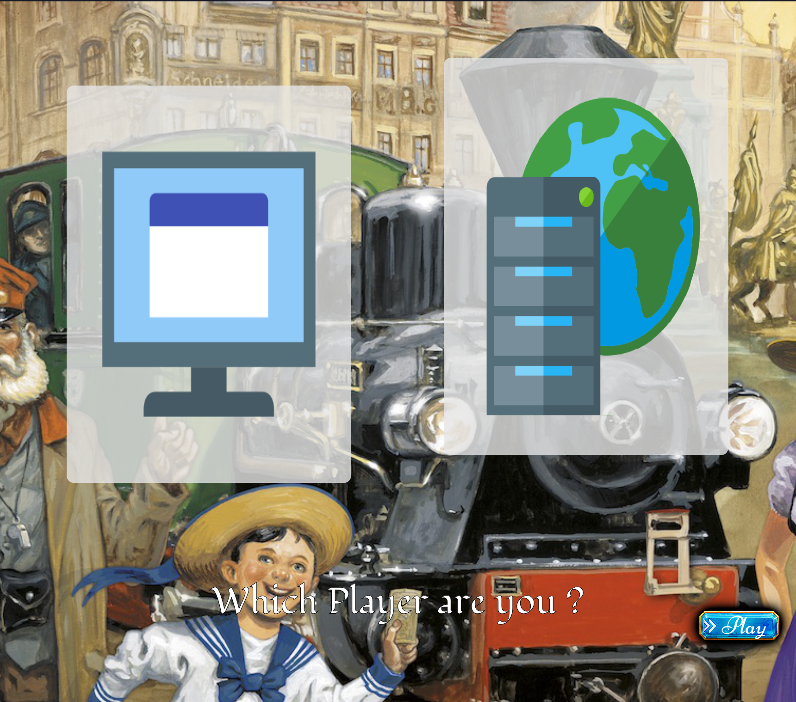
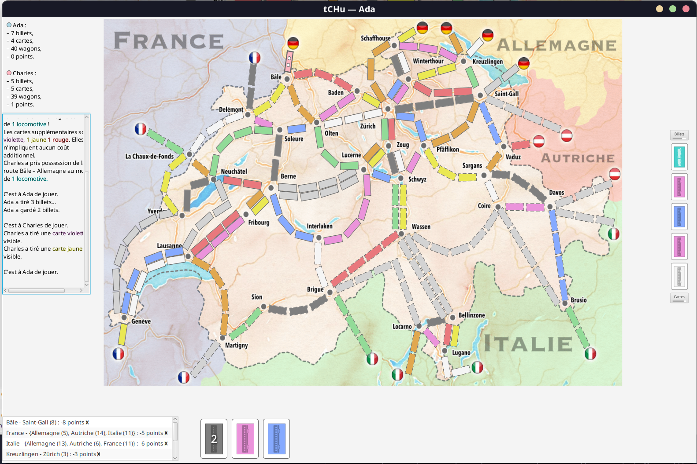

# EPFL - CS-108 Project "tCHu"
 
### *Board game based on ["Ticket to ride"](https://en.m.wikipedia.org/wiki/Ticket_to_Ride_(board_game))*

 Made with:  
 
 
 

<br>

## Game Screenshots

<p align="center">


</p>



<br>


> [!TIP]
> ### Rules: [Explanation & Rules (Wikipedia)](https://en.m.wikipedia.org/wiki/Ticket_to_Ride_(board_game))

---

## Run the game

- **Windows**: Download the executable from the release

- **Linux**:  
    If `unzip` isn't installed, install it.

    ```bash
    git clone https://github.com/David-Kyrat/CS108_Project-tCHu.git
    cd CS108_Project-tCHu
    make merge_split_jar
    make run # Aftewards, only run this command to launch the game
    ```

<br>

> [!NOTE]  
> - An internet connection is required to properly get the fonts of the main-menu from google fonts
